## Fun with Router on Openwrt

Slides and source code can be obtained in Github:

[https://github.com/christlc/open-source-conf-hk2016](https://github.com/christlc/open-source-conf-hk2016) 

Short Link: goo.gl/35LjGu


## What is Openwrt?

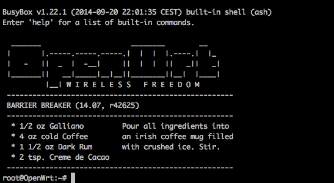

[https://openwrt.org](https://openwrt.org)

## Today's plan

>1. Choose a suitable device for flashing
>2. Flash your router
>3. Extend your storage with USB drive via ExtRoot
>3. Install packages using okpg
>6. Light scythe with Arudino and LED strip
>7. More project ideas

## Supported device

List of hardware with support status:
[https://wiki.openwrt.org/toh/start](https://wiki.openwrt.org/toh/start)

Today we will be using TP-Link MR3020:

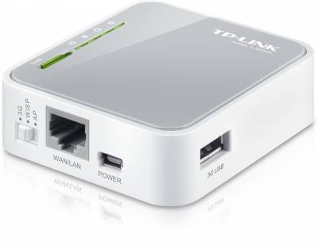

This device has 4MB rom and 32MB ram.  You can also get modified version with 8MB rom and 64MB ram on the web.

## Prepare the Firmware

We can prepare the firmware with the following lines:
```{r, engine = 'bash', eval = FALSE}
wget https://downloads.openwrt.org/chaos_calmer/15.05.1/ar71xx/generic/OpenWrt-ImageBuilder-15.05.1-ar71xx-generic.Linux-x86_64.tar.bz
tar -xvf OpenWrt-ImageBuilder-15.05.1-ar71xx-generic.Linux-x86_64.tar.bz2 
cd OpenWrt-ImageBuilder-15.05.1-ar71xx-generic.Linux-x86_64/
make image PROFILE="TLMR3020" \
    PACKAGES="kmod-fs-ext4 kmod-usb-storage block-mount"
```

Need to pack in a few extra packages(mod-fs-ext4 kmod-usb-storage block-mount) so that we can mount an usb drive.
The created firmware is under the bin/ directory.

## Flash your router

Flash with openwrt-ar71xx-generic-tl-mr3020-v1-squashfs-factory.bin firmware image like a regular firmware update.

<style>
.inlineimg img{
  width:100%;
  max-width:500px
}
</style>

<div class="inlineimg">
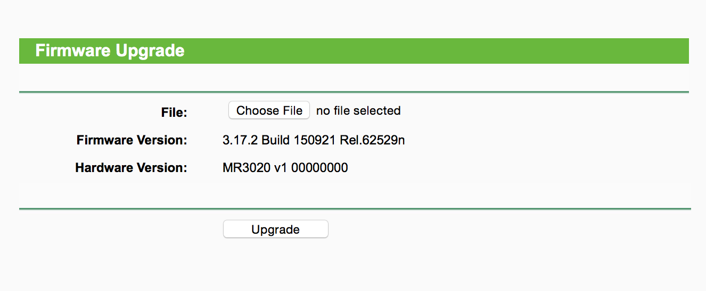
</div>

## Login your router

Follow instructions here to setup password:

```{r, engine = 'bash', eval = FALSE}
telnet 192.168.1.1
```

<div class="inlineimg">
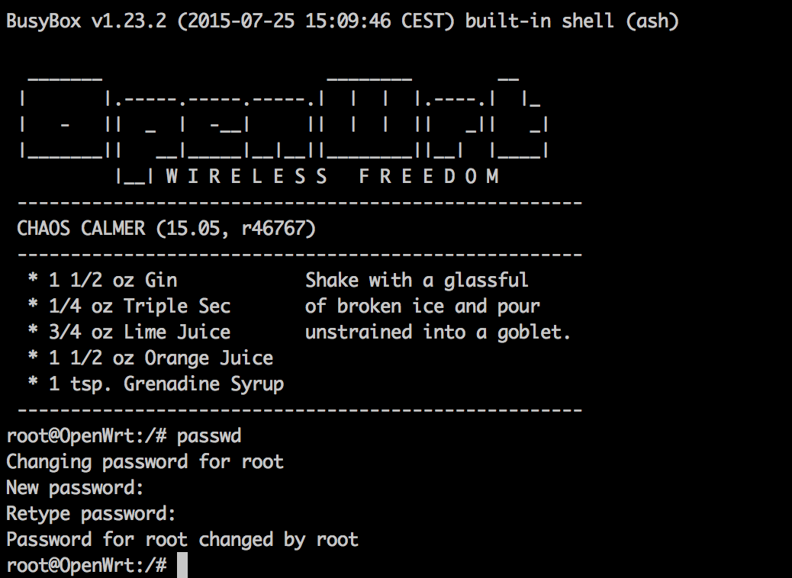
</div>

## Extend the space using USB thumb drive

Since there is only limited rom space on the router, you can easily extend the space using a usb thumb drive.

Prepare a USB drive partitioned with EXT4 and swap:

<div class="inlineimg">
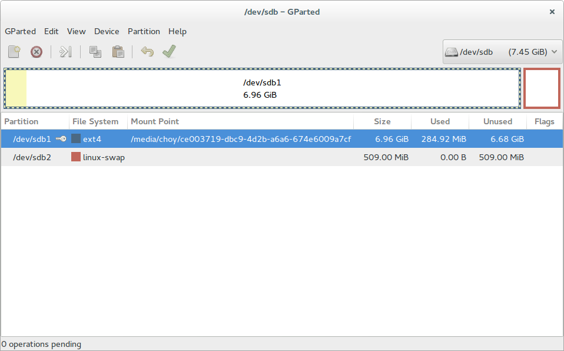
</div>


<!--
1. Prepare a USB drive partitioned with EXT4 and swap
2. Install the USB storage image and EXT4 images packages
3. Copy the system files to the USB drive
4. Edit the /etc/config/fstab file 
5. Reboot and check
-->
## Extend the space using USB thumb drive

Detail instructions here: [https://wiki.openwrt.org/doc/howto/extroot](https://wiki.openwrt.org/doc/howto/extroot)

Code for your reference:
```{r, engine = 'bash', eval = FALSE}
mount /dev/sda1 /mnt ; tar -C /overlay -cvf - . | tar -C /mnt -xf - ; umount /mnt
block detect > /etc/config/fstab; \
   sed -i s/option$'\t'enabled$'\t'\'0\'/option$'\t'enabled$'\t'\'1\'/ /etc/config/fstab; \
   sed -i s#/mnt/sda1#/overlay# /etc/config/fstab; \
   cat /etc/config/fstab;
```


## Install new packages
For example, Python can be installed with just two lines:

```{r, engine='bash', eval=FALSE}
opkg update
opkg install python
```


# Light scyche


## Background


Credits: [The Mechatronics Guy](https://sites.google.com/site/mechatronicsguy/lightscythe)

## My take

<div class="inlineimg">
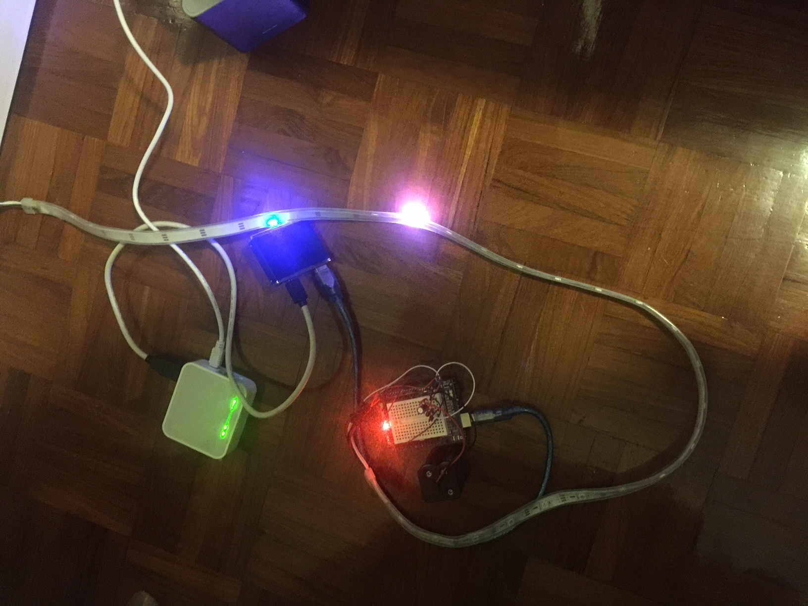
</div>

## Required hardware

7. Router 
5. Arduino Uno
6. USB hub
4. 8GB USB drive
9. LED light strip (WS2812B)
1. 4x AA Batteries
2. Battery holder
3. Some wires and Breadboard to wire things up
4. Some capacitors and resistors


## Arduino (Genuino) Uno
Tons of tutorials and libraries to interface with different hardware, including LED strip.

<div class="inlineimg">
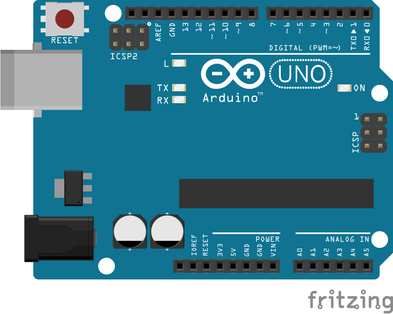
</div> 


## Arduino IDE 

Arduino IDE makes programming with hardware really easy

<div class="inlineimg">
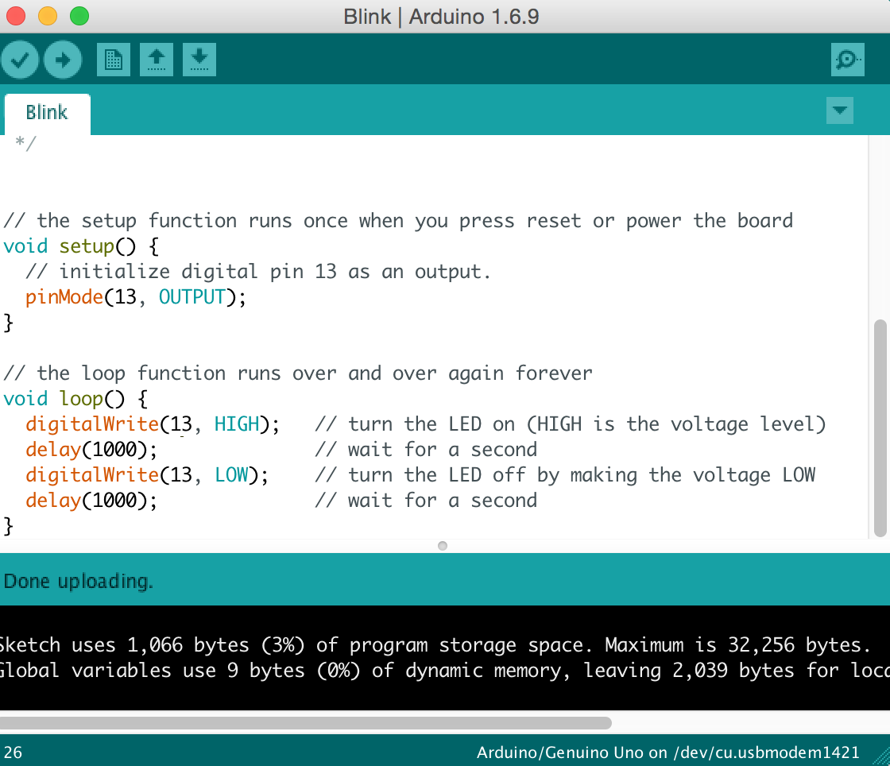
</div>


## Connect Arduino with LED strip

The LED strip we are using is based on WS2812B.

<div class="inlineimg">
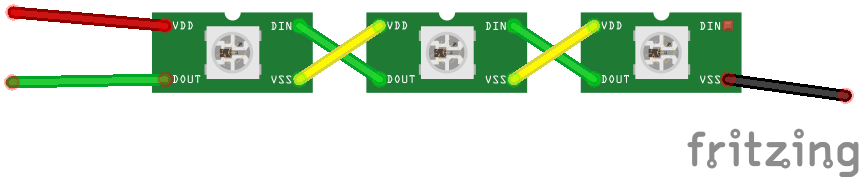
</div>

## Send the signal across

Taken from documentation.
<div class="inlineimg">

</div>

<div class="inlineimg">

</div>

## Sounds complicated? Use library!

Library supporting this strip can be found at 
[https://github.com/adafruit/Adafruit_NeoPixel/](https://github.com/adafruit/Adafruit_NeoPixel/)

```{r, engine='c', eval=FALSE}
#include <Adafruit_NeoPixel.h>
#define PIN            6
#define NUMPIXELS      16
void setup() {
  pixels.begin(); // This initializes the NeoPixel library.
}
void loop() {
  for(int i=0;i<NUMPIXELS;i++){
    pixels.setPixelColor(i, pixels.Color(0,150,0)); // Moderately bright green color.
    pixels.show(); // This sends the updated pixel color to the hardware.
    delay(500); // Delay for a period of time (in milliseconds).
  }
}
```

## Wire it all up 

<div class="inlineimg">
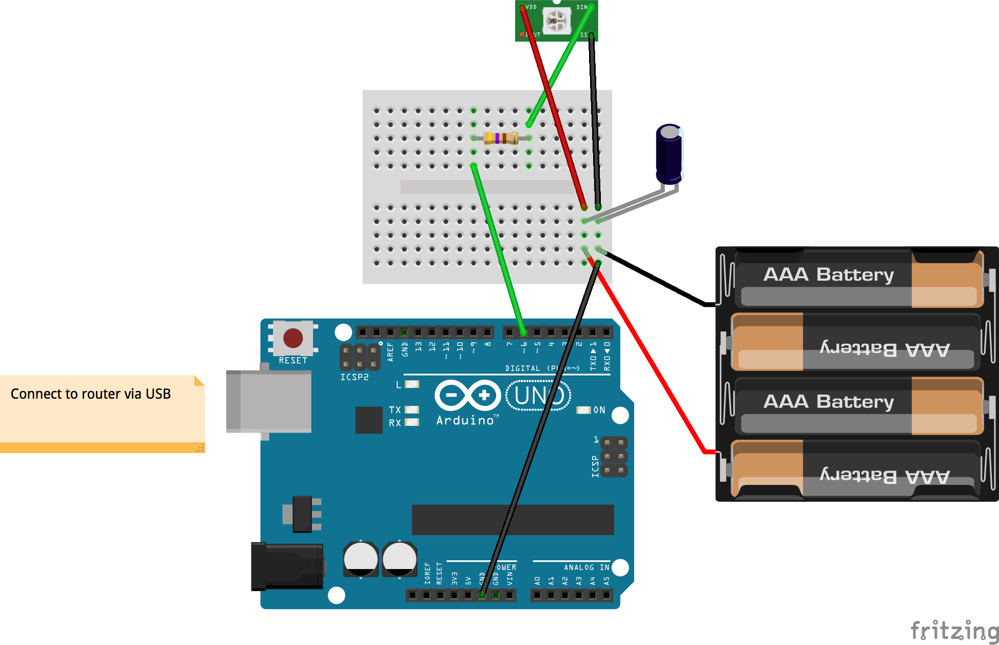
</div>

## Send image from Router via USB

>1. Python to resize image to number of "pixels" on the LED strip
>2. Read the pixel (Red, Green, Blue) values of the resized image
>2. USB serial to send RGB bytestream to Arduino
>3. Arduino to read the serial bytestream and display via LED strip

Code adapted from [https://gist.github.com/ladyada/3309494](https://gist.github.com/ladyada/3309494)


## Resize Image

```{r, engine='python', eval=FALSE}
import Image
img       = Image.open(filename).convert("RGB")
heightPercent = (baseHeight / float(img.size[1]))
width = int((float(img.size[0]) * float(heightPercent)))
img = img.resize((width, baseHeight),Image.BILINEAR)
pixels    = img.load()
width     = img.size[0]
height    = img.size[1]
print "%dx%d pixels" % img.size
```

## Read the pixel values

```{r, engine='python', eval=FALSE}
for x in range(width):
	for y in range(height):
		value = pixels[x, y]
    y3 = y * 3
 		column[x][y3]     = value[0]
		column[x][y3 + 1] = value[1]
		column[x][y3 + 2] = value[2]
```

## Send the values via USB Serial

```{r, engine='python', eval=FALSE}
import time, serial
ser = serial.Serial('/dev/ttyACM0', 38400)
while True:
    for x in range(width):
        for y in reversed(range(height)):
            y3 = y * 3
            ser.write(''+chr(column[x][y3])+chr(column[x][y3+1])+chr(column[x][y3+2]))
        time.sleep(float(skip))
```

## Demo Time


# More ideas

## Inspiration Here

WiFi Sniffer with 10 lines of python

[http://hackoftheday.securitytube.net/2013/03/wi-fi-sniffer-in-10-lines-of-python.html](http://hackoftheday.securitytube.net/2013/03/wi-fi-sniffer-in-10-lines-of-python.html)


## Install Scapy
Scapy is a package to do network packet inspection.

```{r, engine = 'bash', eval = FALSE}
opkg update
opkg install tcpdump
wget http://www.secdev.org/projects/scapy/files/scapy-latest.tar.gz
tar -xvf scapy-latest.tar.gz
cd scapy*
python setup.py install
cd .. 
``` 
More info here: [http://www.secdev.org/projects/scapy/](http://www.secdev.org/projects/scapy/)

## Configure the wifi interface to monitor mode

```{r, engine = 'bash', eval = FALSE}
root@OpenWrt:~# vi /etc/config/wireless
#option disabled 1
config wifi-iface

config wifi-iface
        option device   radio0
        option network  lan
        option mode     monitor
        option hidden   1
root@OpenWrt:~# wifi up; wifi down
```
<!--
## Verify that it's working properly

Verify the status using:
```{r, engine = 'bash', eval = FALSE}
root@OpenWrt:~# iw dev
TODO ADD info here
```
-->
## Collect SSID Data using scapy

Wi-Fi SSID Sniffer in 10 Lines of Python
http://hackoftheday.securitytube.net/2013/03/wi-fi-sniffer-in-10-lines-of-python.html


## Actual code
```{r, engine = 'python', eval = FALSE}
#!/usr/bin/env python

from scapy.all import *

ap_list = []

def PacketHandler(pkt) :
  if pkt.haslayer(Dot11) :
		if pkt.type == 0 and pkt.subtype == 8 :
			if pkt.addr2 not in ap_list :
				ap_list.append(pkt.addr2)
				print "AP MAC: %s with SSID: %s " %(pkt.addr2, pkt.info)

sniff(iface="wlan0", prn = PacketHandler, store=0)
```

## Demo

```{r, engine='bash', eval=FALSE}
root@OpenWrt:~/ssid_scraper# python script.py
WARNING: No route found for IPv6 destination :: (no default route?)
AP MAC: 90:f6:52:00:00:00 with SSID: A-LINK
AP MAC: f8:32:e4:00:00:00 with SSID: My-HOME-5G
AP MAC: a4:2b:b0:00:00:00 with SSID: here
AP MAC: 9c:5c:8e:00:00:00 with SSID: feel_free_to_use
AP MAC: e8:de:00:00:00:00 with SSID: B-LINK
```

<!--
## People Counter
The idea of the people counter is located based on this:

http://edwardkeeble.com/2014/02/passive-wifi-tracking/

WiFi clients emit probe packets that can be catched.

Code: https://bitbucket.org/edkeeble/wifi-scan/src/e2a08627f05ddc16792953449493d56b1c197b30/wifiscan.py?fileviewer=file-view-default


## In action

<div class="inlineimg">
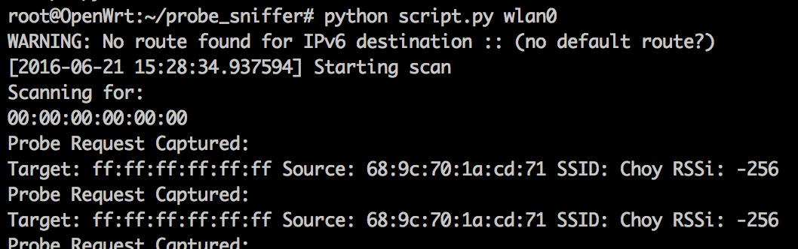
</div>

<!--
More example 
opkg install aircrack-ng
airodump-ng wlan0 -w bus --output-format csv
-->


# Appendix

## Misc

LEDE - Linux Embedded Development Environment
[https://www.lede-project.org](https://www.lede-project.org)

Arduino Starter Kit
[https://www.arduino.cc/en/Main/ArduinoStarterKit](https://www.arduino.cc/en/Main/ArduinoStarterKit)


## Thank you

Slides can be obtained on Github:

[https://github.com/christlc/open-source-conf-hk2016](https://github.com/christlc/open-source-conf-hk2016)

Shortened Link: goo.gl/35LjGu


